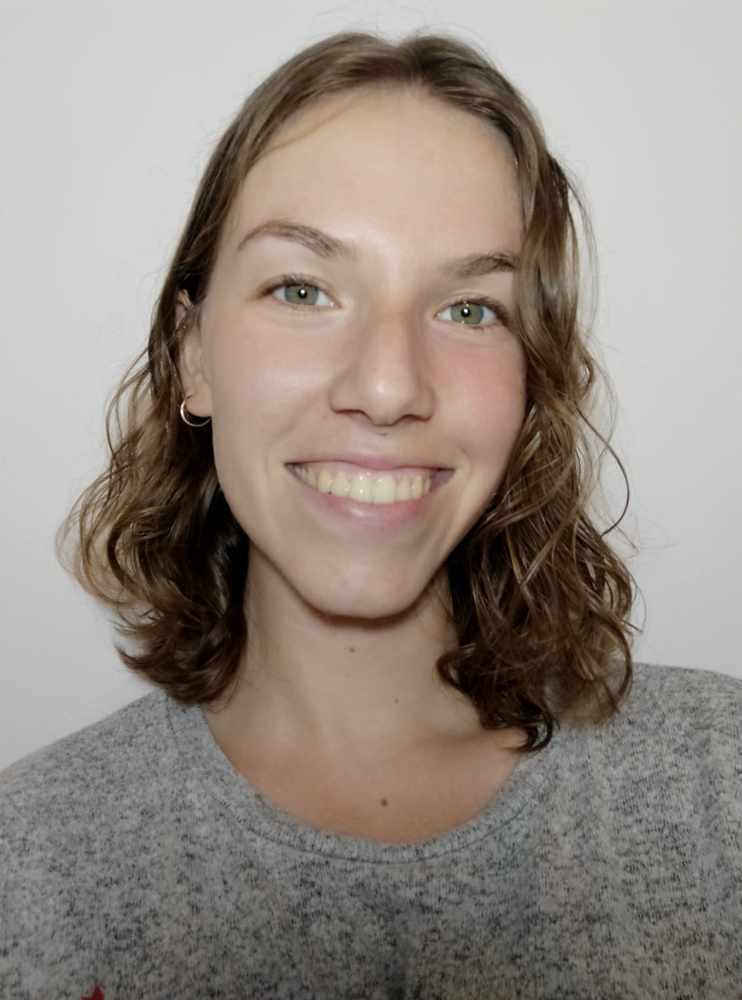

# **Adela González Maury**
## Graduada en Ingeniería Industrial y Desarrollo de Productos 

Para obtener más información sobre el Grado estudiado [pulse aquí](https://eiic.ulpgc.es/index.php/estudios/2015-09-03-13-04-41/grado-en-ingenieria-en-diseno-industrial-y-desarrollo-de-productos) :brain:

Idiomas | Nivel Acreditado
------------ | -------------
Inglés | B1
Italiano | A2

Intereses:
* LSE :raised_hand_with_fingers_splayed:
* Deporte :lotus_position: :woman_cartwheeling:
 
 Camino académico:
1. Infantil
1. Primaria
1. Secundaria
1. Bachillerato
1. Grado
1. *Máster en curso* :smile:

__*Filosofía de aprendizaje experiencial*__

Como ya Confucio citaba en el Siglo V a.C.:
>Escucho y olvido.
>Veo y recuerdo.
>Hago y aprendo :yellow_heart:

